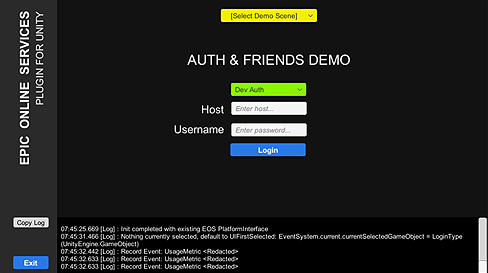
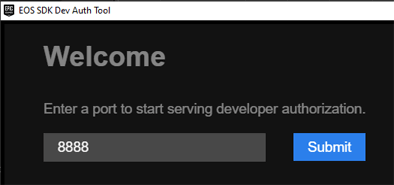

# Epic Online Services Plugin for Unity (UPM Package)

## Overview
The [eos_plugin_for_unity_upm repository](https://github.com/PlayEveryWare/eos_plugin_for_unity_upm) contains a Unity Package Manager (UPM) plugin for enabling the use of [Epic Online Services (EOS)](https://dev.epicgames.com/docs/services/en-US/Overview/index.html) [C# SDK](https://dev.epicgames.com/docs/services/en-US/CSharp/GettingStarted/index.html) in Unity.

For [support issues](https://github.com/PlayEveryWare/eos_plugin_for_unity/issues) or contributing to this open source project, head over to the [source repository](https://github.com/PlayEveryWare/eos_plugin_for_unity).

Things this plugin provides:

* Unity GUI for configuring EOS settings and saving to a JSON file
* Unity editor playback support, handled by reloading EOS SDK
* Feature specific manager classes for most common use-cases of EOS SDK API
* Feature specific samples as Unity scenes
* Targets [EOS SDK 1.13.1](https://dev.epicgames.com/docs/services/en-US/WhatsNew/index.html#1.13-june21) *(bundled with plugin)*
* Targets [Unity 2020.1](https://unity.com/releases/2020-1)

## Supported Platforms

The follow target platforms are supported in Unity for the current release of the plugin.

| Unity Target Platform | Current Plugin Release |
| - | - |
| Windows Standalone x64 | Supported |
| Windows Standalone x86 | Supported |
| Universal Windows Platform x64 | Supported |
| Android | Future |
| iOS | Future |
| Linux | Future |
| MacOS | Future |
| Console Platforms | Future |
| WebGL | Not Supported |
| Universal Windows Platform x86 | Not Supported |
| Unity Web Player | Not Supported |

## Supported EOS SDK Features

The EOS SDK is continually releasing new features and functionality.  The following is a list of EOS features and their support level for the Unity plugin.

| EOS Feature | Included in Sample |
| - | - |
| [Achievements](https://dev.epicgames.com/docs/services/en-US/Interfaces/Achievements/index.html) | Achievements Sample |
| [Authentication](https://dev.epicgames.com/docs/services/en-US/Interfaces/Auth/index.html) | - All Samples - |
| [Ecommerce](https://dev.epicgames.com/docs/services/en-US/Interfaces/Ecom/index.html) | Store Sample |
| [Friends](https://dev.epicgames.com/docs/services/en-US/Interfaces/Friends/index.html) | Auth & Friends Sample |
| [Leaderboards](https://dev.epicgames.com/docs/services/en-US/Interfaces/Leaderboards/index.html) | Leaderboards Sample |
| [Lobby](https://dev.epicgames.com/docs/services/en-US/Interfaces/Lobby/index.html) | Lobbies Sample |
| [Lobby with Voice](https://dev.epicgames.com/docs/services/en-US/Interfaces/Voice/index.html#voicewithlobbies) | Lobbies Sample |
| [NAT P2P](https://dev.epicgames.com/docs/services/en-US/Interfaces/P2P/index.html) | P2P Sample |
| [Player Data Storage](https://dev.epicgames.com/docs/services/en-US/Interfaces/PlayerDataStorage/index.html) | Player Data Storage Sample |
| [Presence](https://dev.epicgames.com/docs/services/en-US/Interfaces/Presence/index.html) | Auth & Friends Sample |
| [Sessions](https://dev.epicgames.com/docs/services/en-US/Interfaces/Sessions/index.html) | Sessions Sample |
| [Stats](https://dev.epicgames.com/docs/services/en-US/Interfaces/Stats/index.html) | Leaderboards Sample |
| [Title Storage](https://dev.epicgames.com/docs/services/en-US/Interfaces/TitleStorage/index.html) | Title Storage Sample |
| [Reports](https://dev.epicgames.com/docs/services/en-US/PlayerModeration/ReportsInterface/index.html) | - No Sample Provided - |
| [Sanctions](https://dev.epicgames.com/docs/services/en-US/PlayerModeration/SanctionsInterface/index.html) | - No Sample Provided - |
| [Anti-Cheat](https://dev.epicgames.com/docs/services/en-US/PlayerModeration/AntiCheat/index.html) | Not Supported |
| [EOS Mod SDK](https://dev.epicgames.com/docs/services/en-US/Interfaces/Mods/index.html) | Not Supported |
| [Voice Trusted Server](https://dev.epicgames.com/docs/services/en-US/Interfaces/Voice/index.html#voicewithatrustedserverapplication) | Not Supported |

---
# Integration Notes
For best results, Unity 2020 is preferred. 

## Installing from a git URL
Ensure you have property setup Unity for [Git Dependency](https://docs.unity3d.com/Manual/upm-git.html).
1. Make sure you have git and git-lfs installed
2. Open the Unity Editor
3. Open the Package Manager.
    * It's listed under ```Window -> Package Manager```
4. Click the ```+``` button
5. Select '```Add Package from Git URL```'

    

6. Paste in ```git@github.com:PlayEveryWare/eos_plugin_for_unity_upm.git```
   or ```https://github.com/PlayEveryWare/eos_plugin_for_unity_upm.git```


## Installing from a tarball
1. From the Unity Editor, open the Package Manager
    * It's listed under ```Window -> Package Manager```
2. Click the ```+``` button
3. Select '```Add package from tarball```'

    

4. Go to directory containing the PEW Unity plugin tarball, and select it
5. Click ```Open```

---
# Configuring the Plugin

To get the EOS working, the plugin needs to know some specific things about your EOS project.

## Prerequisites
* One has a Unity project one would like to have the plugin integrated into
* One has a Epic Games Account, which you may sign up for [here](https://dev.epicgames.com/portal/)
* One has accepted the Terms for the [Epic Online Services](https://www.epicgames.com/site/en-US/tos?lang=en-US)
* One has configured a product on the [Epic Games Developer Portal](https://dev.epicgames.com/portal/)

## Steps
1) Open your Unity project with integrated plugin 
2) In the Unity editor, Open ```Tools -> EpicOnlineServicesConfigEditor```

    

3) Configure the EOS plugin

    

4) From the [developer portal](https://dev.epicgames.com/portal/), copy the configuration values listed below, and paste them into the similarly named fields in the editor tool:
    * ProductName
    * ProductVersion
    * [ProductID](https://dev.epicgames.com/docs/services/en-US/Glossary/index.html#D?term=ProductId)
    * [SandboxID](https://dev.epicgames.com/docs/services/en-US/Glossary/index.html#D?term=SandboxId)
    * [DeploymentID](https://dev.epicgames.com/docs/services/en-US/Glossary/index.html#D?term=DeploymentId)
    * [ClientSecret](https://dev.epicgames.com/docs/services/en-US/Glossary/index.html#D?term=ClientSecret)
    * [ClientID](https://dev.epicgames.com/docs/services/en-US/Glossary/index.html#D?term=ClientId)
    * EncryptionKey
   
At this point, you are ready to start developing using the Epic Online Services Plugin for Unity!  Simply attach <code>EOSManager.cs (Script)</code> to a Unity object and it will intialize the plugin with the specified configuration in <code>OnAwake()</code>.

If you would like to see examples of each feature, continue installing samples below.

---
# Samples

The included samples show fully functional feature implemenation that will both help with EOS integration as well as validate client to dev portal configuration.  After installing the samples from the UPM package, you will find scenes for each major feature.


In addition, the samples include Unity friendly *feature* Managers that can help to quickly integrate new EOS features into your title.  They provide functional usage of the main feature functionality and can be a good base template.

## Installing the samples
To use the samples, install them from the UPM manager.


The samples include both usage of the EOS SDK, and convience wrappers to make using the SDK more ergonomic in the Unity Game Engine. By being samples in the UPM sense, they are placed under Assets which allows modification.

## Running the samples
* Launch Unity project with the samples installed

* In the Unity editor, hit ```Play```

* Login with a selected authentication type

    

---
# Authentication


## Running and Configuring the EOS SDK Dev Auth Tool
* Launch the [dev auth tool](https://dev.epicgames.com/docs/services/en-US/DeveloperAuthenticationTool/index.html)

    

* Pick a port to use on the computer. 8888 is a good quick to type number that isn't usually used by a process
* Log in with one's user credentials that are registered with Epic
* Pick a username. This username will be used in the sample to log in

More specific and up-to-date instructions can also be found on Epic's [website](https://dev.epicgames.com/docs/services/en-US/DeveloperAuthenticationTool/index.html)


---
# Open Source: Contribute

This is an Open Source project.  If you would like to view and contribute to the development of this plugin, you can enlist in the plugin development repo located at
https://github.com/PlayEveryWare/eos_plugin_for_unity

---
# Plugin Support

EOS Plugin for Unity API Documentation can be found at https://eospluginforunity.playeveryware.com

For issues related to integration or usage of the Unity plugin, please create a ```New Issue``` under the [Issues](https://github.com/PlayEveryWare/eos_plugin_for_unity/issues) tab of the [main repo](https://github.com/PlayEveryWare/eos_plugin_for_unity).

For issues related to Epic Online Services SDK, Epic Dev Portal or general EOS SDK information, please go to [Epic Online Services Community Support](https://eoshelp.epicgames.com/)

Detailed descriptions and usage for EOS SDK Interfaces, can be found at [EOS Documentation: Interfaces](https://dev.epicgames.com/docs/services/en-US/Interfaces/index.html).

